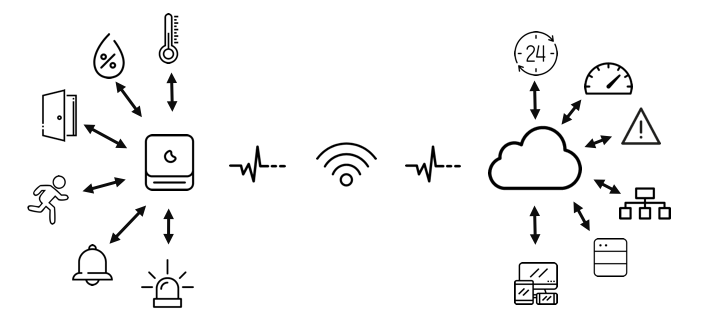

# myDoorKepper
By tracking the data from sensors, this project helps to enhance the security of your house. For example, the status of the door, windows or the motion at some areas will be monitoring continuously. If the door is forgot to close, or be opened unexpectedly at night, there will be an alert, can be notification to mobile or trigger an alarm. 
In addition, some environment data, like temperature, humidity value… also be monitored.

Future idea:
* Send warning if there is unclosed doors or windows when you are leaving your house.
* Detect who coming

Related Repositories:
  * Cloud: https://github.com/hiik3n/myDoorKepper_Cloud
  * Hub: https://github.com/hiik3n/myDoorKepper_Hub
  * Knot-Ble: https://github.com/hiik3n/myDoorKepper_Knot_Ble
  * Knot-Wlan: https://github.com/hiik3n/myDoorKepper_Knot_Wlan

### The system contains 3 mains components:

* **Knot**: smallest devices, directly collect data from sensors or control actuators.

  Knot is device that is equipped some sensors, for example:
   
  * Door open/close sensor (contact sensor)
  * Temperature sensor
  * Humidity sensor
  * Light sensor
  * Movement detector

  It also has some actuators:
  * Buzzer (bell)
  * Light (Lamp)

  There is 2 kind of knots base on the protocol they use to communicate with the Hub:
  
  * *Bluetooth Low Energy (BLE)*: The BLE knot will broadcast BLE packages with encrypted data. The Hub will capture these package then decrypt data to have value of sensors.
  
    BLE is chosen because its low-energy consumption and the advanced connectivity of Bluetooth. It is suitable for robust devices with battery power.
    
    However, it has a weakness is short-range (approximate 10m in-door). The new version of Bluetooth (Bluetooth 5) is promised to extend the range up to 4 times. Therefore, BLE will be more fit in to an indoor system.
The current version of BLE is 4.2, due to available of devices.

  * *WLAN*: unlike BLE, the WLAN-Knot will connect with Hub over WLAN network. The data exchanged between Knot and Hub by using secured MQTT protocol. The speed of transferring data will much faster comparing to BLE, but it also cost a lot of energy.
    WLAN is more suitable for line-powered devices

* **Hub**: gather all submitted data from Knots, then send to the Cloud.

  Hub is device that be able to communicate with Knots over Bluetooth and WLAN. It also able to communicate with the Cloud via Internet.
  
  Hub can be featured some calculation or action with its collected data before transfer them to the Cloud.

* **Cloud**: store and analyze collected data. Trigger some action if needs.

  Cloud is end-destination of sensor data. Data will be stored inside the database in the Cloud. 
  
  The Cloud will also perform some action to analyzing the collected data. Display result to Dashboard (Administration page) or Monitoring page.
  
  If some rules of sensor data have been violated, some alerts or notifications will be triggered by the Cloud to users. There many ways to indicate alert to users:
  * Notification on the Mobile (special app is required)
  * Sending email to users.
  * Active buzzer or the bell (triggered by the Cloud, action on the knots).
  * Turn the light (or lamp) on or off (triggered by the Cloud, action on the knots).

* In addition, there is other device like Supporter, which help to extend the network range of the Hub. It is also forwarded messages from Knot to Hub. 

### Design:

* **Define protocols for the communication between devices**

  * Knot-Hub:
    * BLE:
      * Sensor message (GAP)
      * Log message (GAP)
      * Config message (GATT)
      * Firmware message (GATT) 
    * WLAN:
      * Sensor message (MQTT)
      * Log message (MQTT)
      * Config message (MQTT)
      * Firmware message (MQTT)
      
  * Hub-Cloud (over WLAN/Internet):
    * Sensor message (MQTT)
    * Log message (MQTT)
    * Config message (MQTT)
    * Firmware message (MQTT)
  
* **Knot**
  * Software:
    * Acquire signal from sensor
    * Process acquired data (encrypt)
    * Transmit processed data
    * Adjust acquired frequency
    * Update OTA
    * Logging
  * Hardware:
    * Battery-powered device (BLE)
    * Cable-powered device (BLE/WLAN)
    * Design PCB and the cover for knot

* **Hub**
  * Software:
    * Collect data from knot (BLE/WLAN)
    * Process collected data (from knot)
    * Publish processed data (from knot) to cloud
    * Asynchronous message (to Cloud/Knot)
    * Update OTA
    * Send Firmware to Knot
    * Logging
    * Device management
  * Hardware: TBD

* **Supporter** TBD
 
* **Cloud**
  * Services:	
  * Database (PostgreSQL/InfluxDB)
  * Message Broker (Mosquito)
  * Message Handler 
  * Monitoring Panel (Grafana/ Chronograf)
  * Administration Panel
  * Device Management
  * Location Management
  * System Status
  * Rule Management
  * User Management
  * Notification and Alert (Email, SMS, Action on Knot…)
  * Authentication
  * Logging

* **Mobile’s application**
  * Dashboard
  * Notification and Alert

## Planning:

* **Milestone00:** Preparation
  - Create Github Repositories
  - Create Trello Board

* **Milestone01:** Basic

  1. Setup basic cloud infrastructure
    - Design database, software and system architecture
    - Database (for Sensor Message)
    - Secure Message Broker
    - Message Handler
    - Monitoring Panel
    
  2. Develop basic firmware for Knot
    - Design software architecture
    - Transmit sensor data (BLE/WLAN)
    
  3. Develop basic software for Hub
    - Design software architecture
    - Secure Message Broker (WLAN)
    - Capture sensor message from Knot
    - Senor message Handler
    - Publish sensor message to Cloud

* **Milestone02:** Standard

  1. Cloud:
    - Develop Administration Panel
    - Develop Notification and Alert
    - Authentication
    
  2. Mobile:
    - Dashboard
    - Notification and Alert
    - Authentication
    
  3. Hub:
    - Device Management
    - Asynchronous Message
    
  4. Knot:
    - PCB Design
    - Cover Design

* **Milestone03:** Advanced

  1. Cloud:
    - Hub/Knot Update
    - Logging
    
  2. Hub:
    - Update OTA
    - Knot Update
    - Logging
    
  3. Knot:
    - Update OTA
    - Logging

